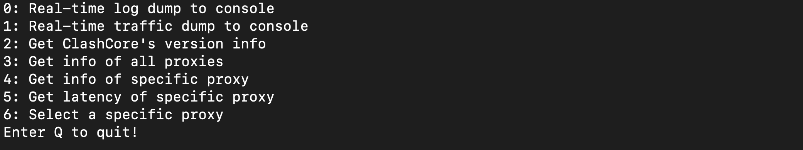

# clash_cli

A simple clash_core cli. Implemented in Java

## Supported api
- Dump real-time traffic to console
- Dump real-time log to console
- Get information of all proxies
- Get information of specific proxy
- Select specific proxy
- Show all proxies info 

***Options 0 and 1 are HTTP streaming API, enter C to exit***

## Environment
- JDK7+