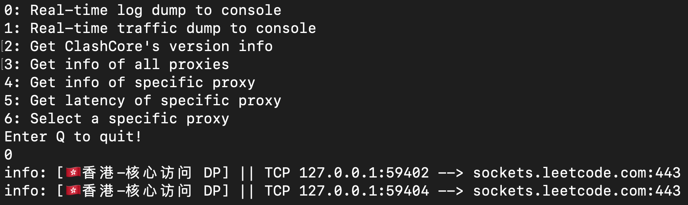

# clash_cli

> A simple clash_core RESTful interactive cli. Implemented in Java.

## Supported api
- Dump real-time traffic to console ☑️
- Dump real-time log to console ☑️
- Get information of all proxies ☑️
- Get information of specific proxy ☑️
- Select specific proxy [In Progress]
- Show all proxies info ☑️

***Options 0 and 1 are HTTP streaming API, press enter to exit***

## Environment
- JDK8+ (Runtime)
- Maven (Compile)

## Dependency
- Gson
